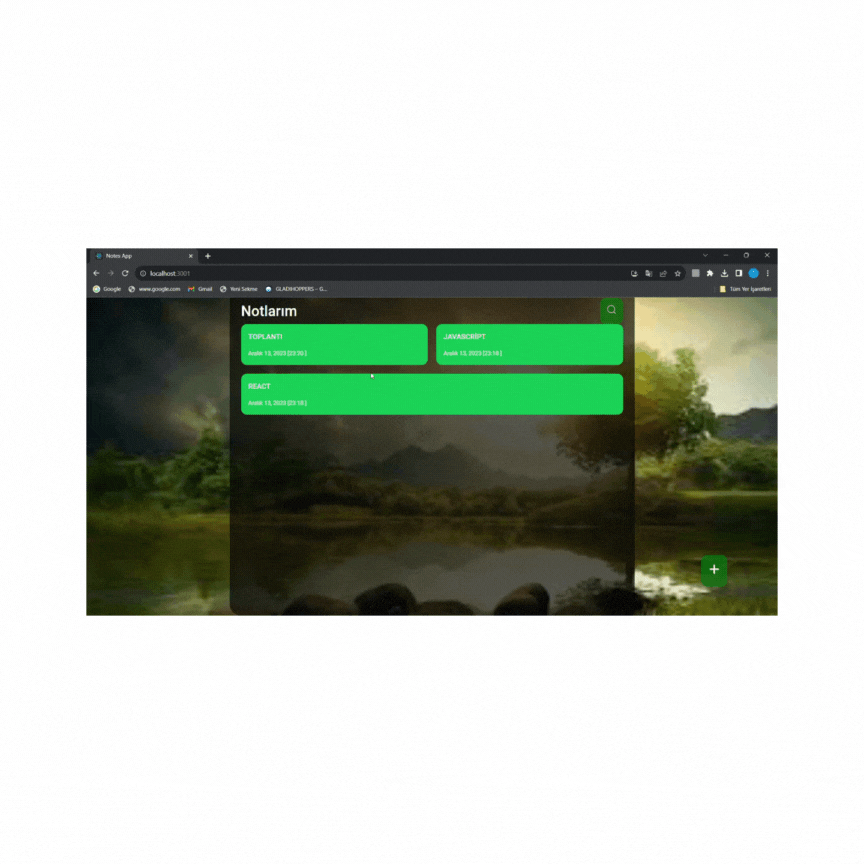

# notesApp-React
<h1>notesApp-React</h1>
🚀This project is a user-friendly note-taking application built using a contemporary interface with React. 🚀

📚Utilizing the React library, the application uses React Router DOM for seamless page integration, allowing users to quickly move between different sections. 
📑A search bar is integrated for efficient note taking, allowing users to quickly find the note they are looking for among multiple created notes. 
🔎For each note created, the inclusion of delete and update icons improves user control, making it easy to effortlessly remove or modify notes as needed. 
📄The app stores notes in the browser's local storage, ensuring data persistence and that notes are not lost even when users close the browser. 

<h1>used technologies</h1>

🛠 React, React Router DOM, React Icons

